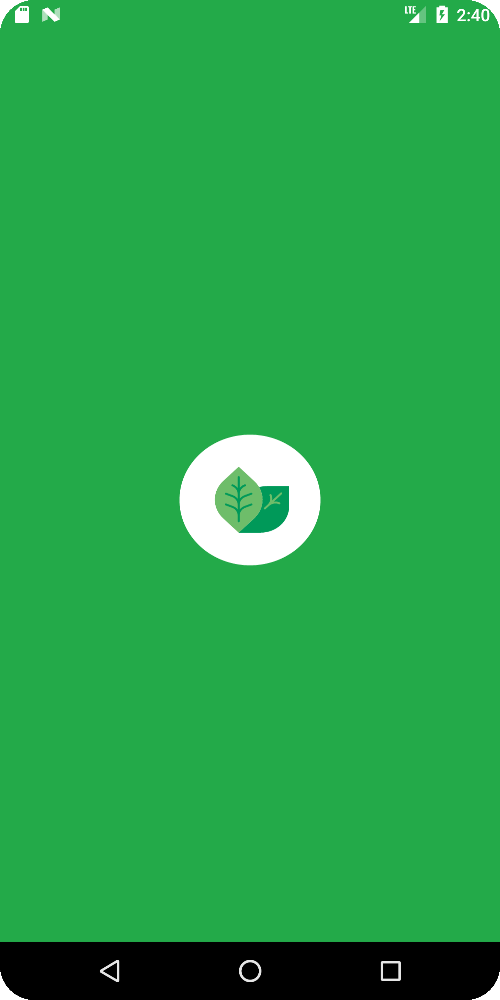
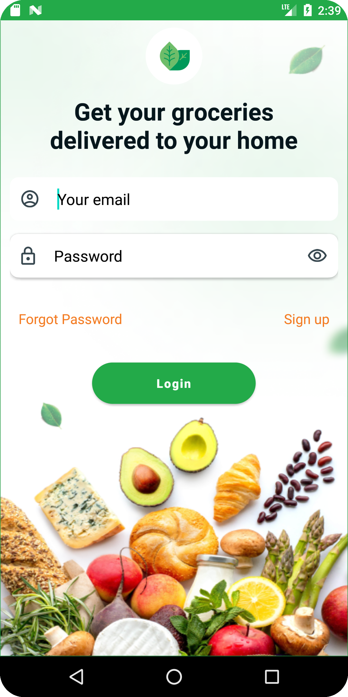
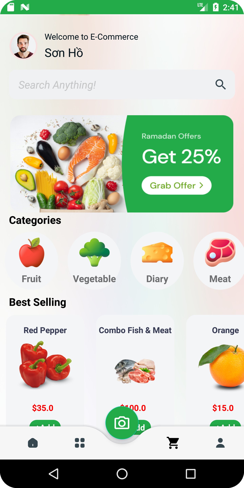
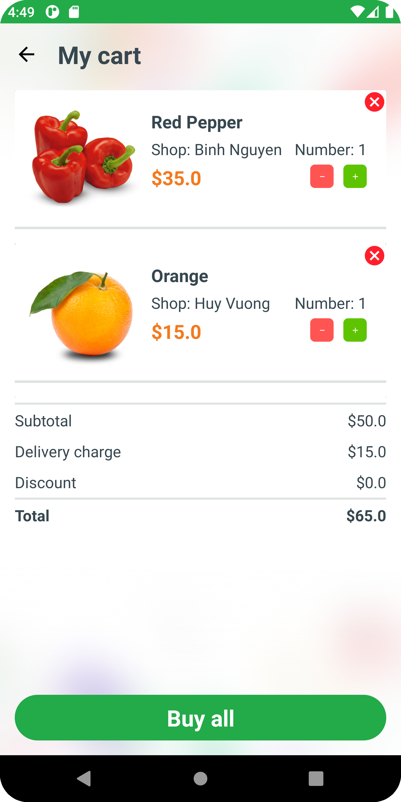
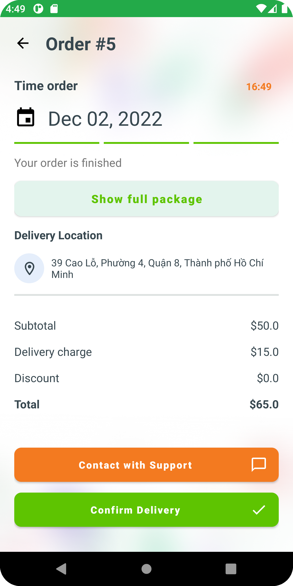
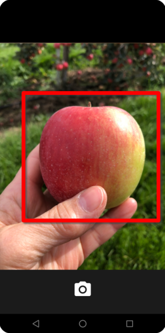
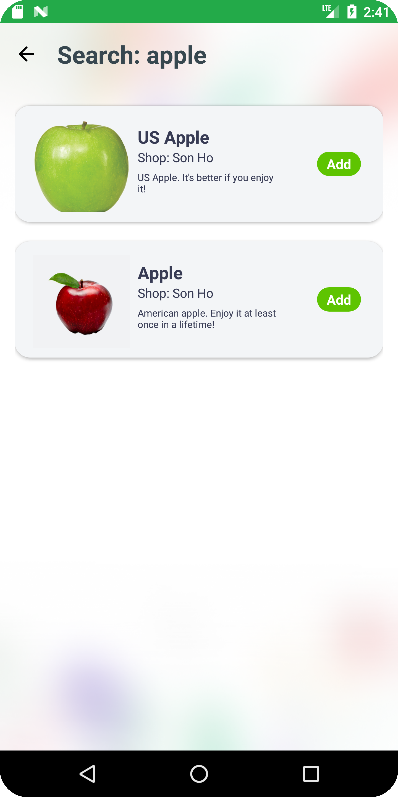
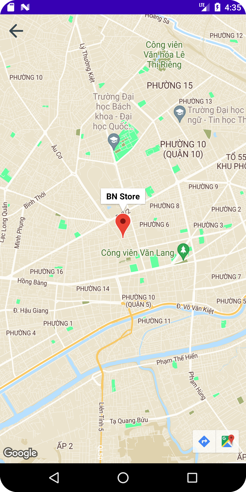
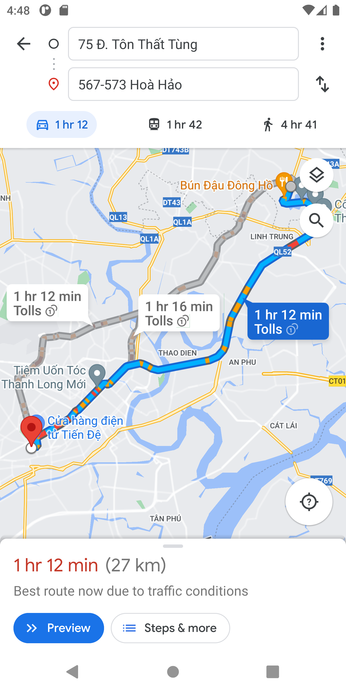

# E-Commerce  

It is an simple e-commerce app designed in for retail grocery stores and their surrounding clients.  It will receive from a farther-off shop in the backend. Smaller company owners will benefit from this instead of large online retailers . Technologies used in this project are android with java, database in Firebase, Google Map API, and Tensorflow Lite which is own by google.

  

## Author
- **Ho Van Son - 20120021** | [@sonhv3112](https://github.com/sonhv3112)
- **Nguyen Quang Binh - 20120412** | [@nqbinhcs](https://github.com/nqbinhcs)
- **Vuong Gia Huy - 20120014** | [@cubist38](https://github.com/cubist38)

## Features

The android app lets you:
- Register and login
- Friendly Feed interface
- Search products by text/camera
- Sort products by type
- Recommend products with high purchasing power
- Support to view detailed product information
- Product reviews
- Cart management
- View shop location
- Select payment method
## Screenshots

### Login

### Main

### Vision Search

### Map

## Permissions

On Android versions prior to Android 6.0, wallabag requires the following permissions:
- Full Network Access.
- View Network Connections.
- Read and write access to external storage.

## License

This application is released under Apache 2.0 (see [LICENSE](LICENSE)).
Some of the used libraries are released under different licenses.
