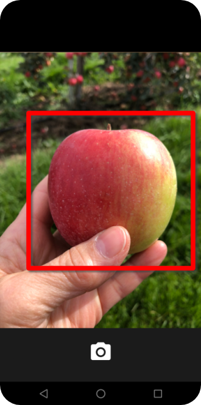

# E-Commerce  

wallabag is a self-hosted read-it-later app.  
Unlike other services, wallabag is free and open source.  
wallabag for Android is a companion app for [wallabag](https://www.wallabag.org). You need a wallabag account first, which you are going to use in this app.

wallabag is available on the Google Play Store and F-Droid.

  

## Tech stack

## About

wallabag has been made for you to comfortably read and archive your articles.
You can download wallabag from wallabag.org and follow the instructions to install it on your own server.
Alternatively, you can directly sign up for [wallabag.it](https://wallabag.it).

This android application allows you to put a link in your wallabag instance, letting you read your wallabag links offline.

This application was originally created by Jonathan GAULUPEAU and released under the GNU GPLv3.
wallabag is a creation from Nicolas Lœuillet released under the MIT License (Expat License).

## Features

The android app lets you:
- Connect to your self-hosted wallabag instance or connect to your [wallabag.it](https://wallabag.it) account.
- Supports wallabag 2.0 and higher.
- Completely ad-free.
- Increase and decrease the size of the font and also switch between a serif or sans-serif font for a more comfortable reading experience.
- Switch between numerous themes.
- Possibility to cache images locally for offline reading.
- Get articles read via Text-to-Speech feature.
- Needs no special permissions on Android 6.0+.

## Screenshots

### Login

### Main

### Vision Search

### Map

## Permissions

On Android versions prior to Android 6.0, wallabag requires the following permissions:
- Full Network Access.
- View Network Connections.
- Run at startup.
- Read and write access to external storage.

The "Run at startup" permission is only used if Auto-Sync feature is enabled and is not utilised otherwise. The network access permissions are made use of for downloading content. The external storage permission is used to cache article images for viewing offline.

## Contributing

wallabag app is a free and open source project developed by volunteers. Any contributions are welcome. Here are a few ways you can help:
 * [Report bugs and make suggestions.](https://github.com/wallabag/android-app/issues)
 * [Translate the app](https://hosted.weblate.org/projects/wallabag/android-app/) (you don't have to create an account).
 * Write some code. Please follow the code style used in the project to make a review process faster.

## License

This application is released under Apache 2.0 (see [LICENSE](LICENSE)).
Some of the used libraries are released under different licenses.
